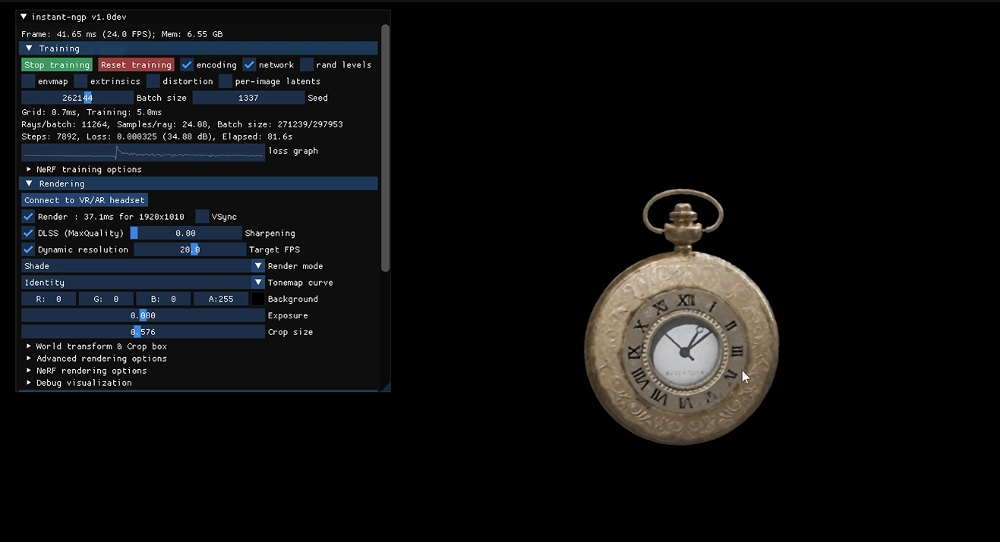
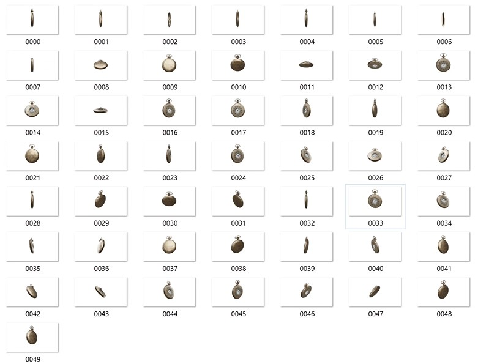

# Synthetic INSTANT-NGP Dataset Blender Addon

_Instant-ngp_ - [GitHub - NVlabs/instant-ngp: Instant neural graphics primitives](https://github.com/NVlabs/instant-ngp)

## Overview
The Synthetic INSTANT-NGP Dataset Blender Addon simplifies the process of creating synthetic datasets for training with Nvidia's Instant-NGP (NeRF) by automating the generation of camera animations around an object. This addon captures frames from various angles and saves the corresponding camera data for later use in training.

This addon is a streamlined adaptation of the BlenderNerf addon created by Maxime Raafat. If you are looking for a much more customized and flexible version, we recommend using his [BlenderNerf addon](https://github.com/maximeraafat/BlenderNeRF).

We also recommend watching his YouTube video about the BlenderNerf addon: [AI RENDERING from Blender to NeRF | BlenderNeRF Tutorial](https://www.youtube.com/watch?v=C8YuDoU11cg).

| Blender Addon                         | Dataset                               |
| ------------------------------------- | ------------------------------------- |
|  |  |

_Clock Synthetic dataset rendered with AWS Batch. 50 frames, CYCLES Engine, 10 samples per frame, 4k resolution._

## Motivation
We created this addon to understand how the Instant-NGP and NeRF concepts work in general.

While not experts in the field, we are currently conducting cloud rendering tests with AWS Batch and Blender. We thought we could generate a simplified addon to quickly create datasets with AWS Batch, allowing us to render each frame in parallel and create the `transforms_train.json` file in minutes.

So far, we have successfully generated these datasets with AWS Batch and we are building a solution to work dynamically and process .blend scenes from S3, automating the process (as the .blend file is currently statically in the Docker image).

The addon is designed to work both locally and on the cloud system we are currently working on.

If you are interested in the AWS Batch implementation, you can check out [this repository](https://github.com/jer-nc/blender-aws-batch-instant-ngp-dataset) (WIP - STATIC VERSION) of the Docker image with Blender and the logic to render synthetic datasets for instant-ngp.

## Features
- **Camera Animation**: Easily create camera animations around a specified object.
- **Flexible Frame Configuration**: Choose the number of frames for the animation, allowing customization according to your requirements.
- **AABB (Axis-Aligned Bounding Box) Control**: Adjust the AABB scale to fit the object.
- **Export Name and Output Folder Configuration**: Specify a unique export name and an output folder for organized dataset management.
- **Render Automation**: Render the animation with a single click, and the addon will take care of the rest.

## Installation
- Download the addon as a ZIP file.
- In Blender, go to Edit > Preferences > Add-ons.
- Click Install and select the downloaded ZIP file.
- Enable the "Synthetic NGP Dataset Blender Addon."

## Usage
- **Accessing the Addon**: Once installed, you can find the addon in the 3D view sidebar under the "BNGP Dataset" tab.
- **Camera Configuration**: Adjust the camera radius, the number of frames, and the AABB scale to fit your scene.
- **Dataset Configuration**: Specify the export name and output folder to organize your dataset.
- **Animation Update**: Click the "Update Animation" button to create the camera animation.
- **Render Animation**: After updating the animation, use the "Render Animation" button to render frames and save camera data.
- **Output**: Rendered frames and camera data are saved in the specified output folder with the chosen export name.

## Authors

- [jer-nc](https://github.com/jer-nc)
- [david-blg](https://github.com/david-blg)

## References
1. BlenderNerf Repo - [BlenderNerf Github](https://github.com/maximeraafat/BlenderNeRF)
2. GitHub - NVlabs/instant-ngp: Instant neural graphics primitives https://github.com/NVlabs/instant-ngp.
3. Batch Processing - AWS Batch - AWS. https://aws.amazon.com/batch/.
